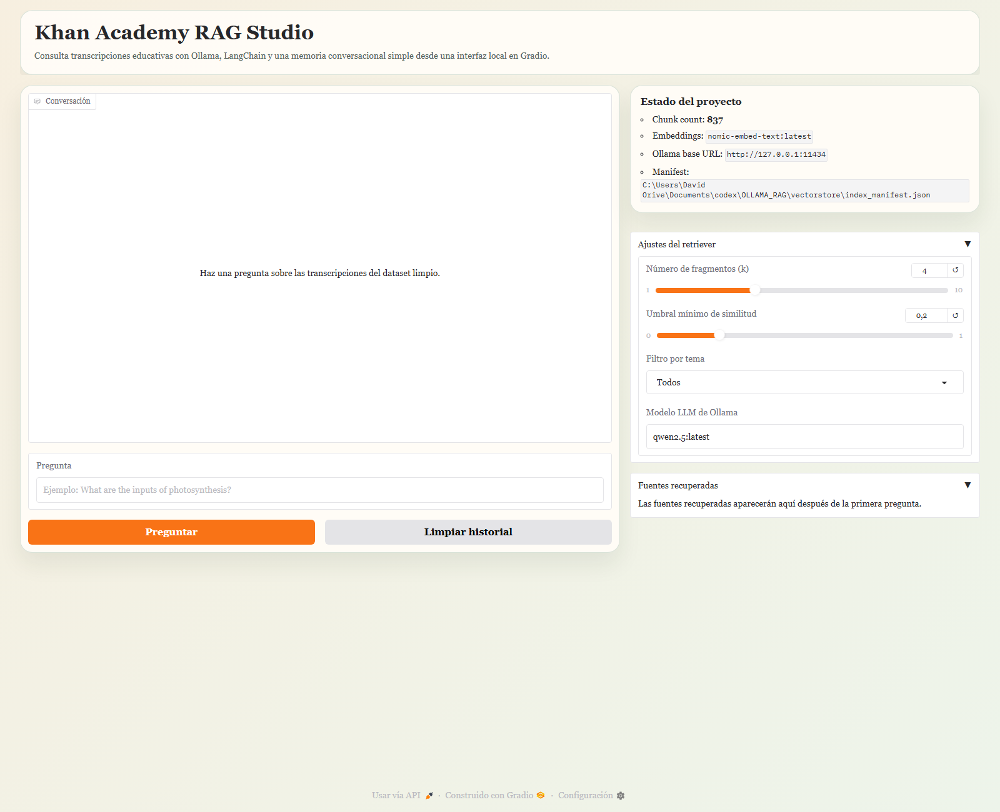
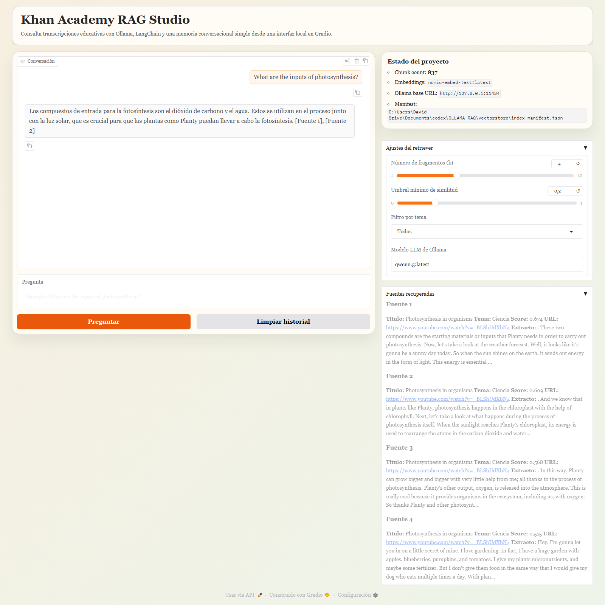
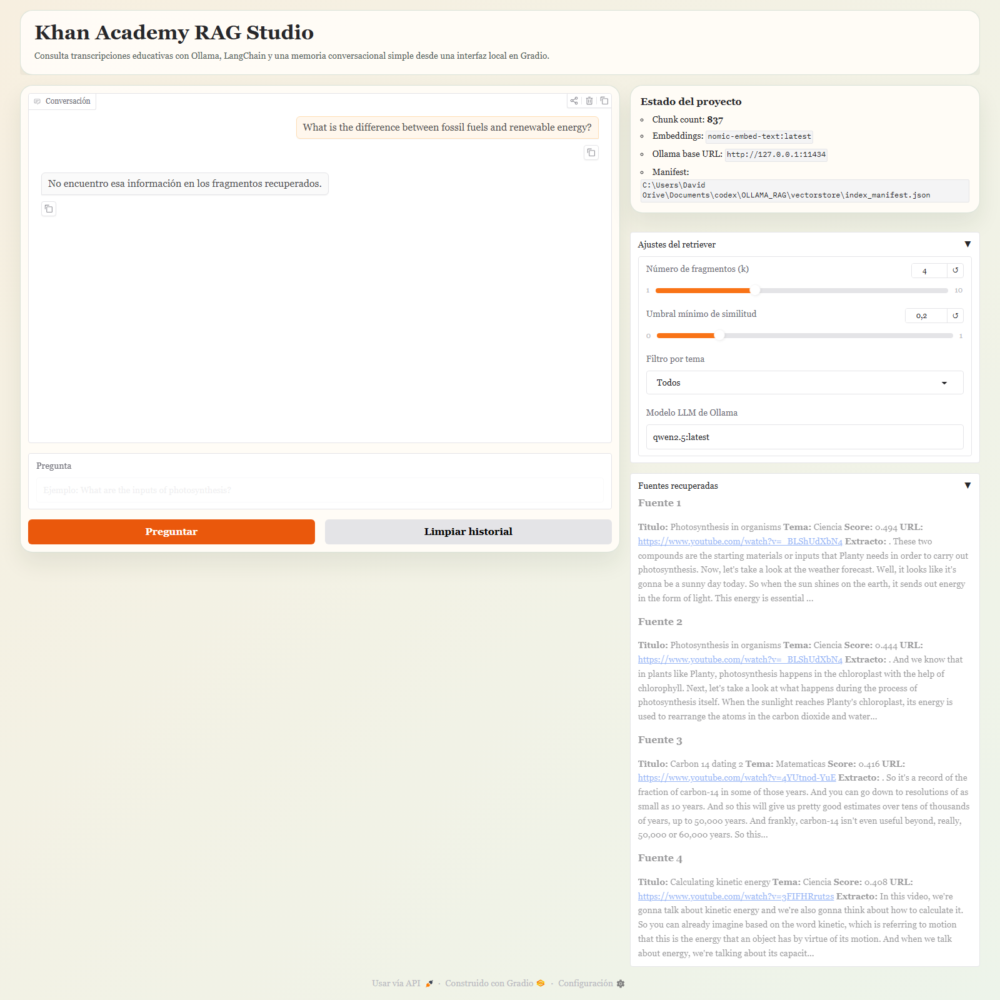

# Sistema RAG con Ollama, LangChain y Gradio

Proyecto completo para la tarea de RAG sobre transcripciones de Khan Academy usando:

- limpieza reproducible del dataset
- embeddings locales con Ollama
- base de datos vectorial Chroma persistida en disco
- pipeline RAG con memoria conversacional básica
- interfaz local con Gradio

## Estructura

- `clean_json.py`: descarga y limpia el dataset, y genera `train_clean.json`
- `index_data.py`: divide el contenido en chunks, crea embeddings y construye el índice vectorial local
- `app.py`: interfaz Gradio + pipeline RAG
- `rag_utils.py`: utilidades compartidas
- `train_clean.json`: dataset limpio en formato JSON, con un subconjunto balanceado por tema
- `vectorstore/`: índice persistente generado por `index_data.py`
- `screenshots/`: capturas reales del proyecto en funcionamiento

## Requisitos

- Python 3.11 recomendado
- Ollama instalado y en ejecución local
- Al menos un modelo generativo local en Ollama
- El modelo de embeddings `nomic-embed-text`

Modelos recomendados:

- `ollama pull nomic-embed-text:latest`
- `ollama pull llama3.2:latest`

En esta máquina también funciona con `qwen2.5:latest` como LLM local.

## Instalación

### PowerShell

```powershell
py -3.11 -m venv .venv
.\.venv\Scripts\Activate.ps1
pip install -r requirements.txt
```

## Flujo de ejecución

### 1. Limpiar y preparar el dataset

```powershell
python clean_json.py --max-records 120
```

Notas:

- El script descarga `iblai/ibl-khanacademy-transcripts` desde Hugging Face si no indicas `--input-json`.
- Las transcripciones vacías o demasiado cortas se descartan.
- Se eliminan cabeceras VTT, timestamps, ruido y espacios sobrantes.
- El campo `url` final apunta al vídeo (`video_url`) y se conserva la URL original de subtítulos en `subtitle_url`.
- El campo `topic` se infiere para poder usar el filtro temático en la interfaz.

### 2. Crear el índice vectorial

```powershell
python index_data.py
```

Si quieres forzar un modelo concreto para embeddings:

```powershell
python index_data.py --embedding-model nomic-embed-text:latest
```

### 3. Lanzar la interfaz Gradio

```powershell
python app.py
```

La aplicación incluye:

- chat con historial conversacional
- control deslizante para `k`
- control deslizante para el umbral de similitud
- desplegable para filtrar por tema
- panel con los fragmentos recuperados
- botón para limpiar el historial

## Variables de entorno opcionales

Puedes definir estas variables si quieres personalizar los modelos o la URL de Ollama:

- `OLLAMA_BASE_URL`
- `OLLAMA_LLM_MODEL`
- `OLLAMA_EMBED_MODEL`

Ejemplo:

```powershell
$env:OLLAMA_LLM_MODEL="qwen2.5:latest"
$env:OLLAMA_EMBED_MODEL="nomic-embed-text:latest"
python app.py
```

## Capturas del proyecto funcionando

### 1. Vista inicial de la interfaz



### 2. Respuesta con contexto recuperado

Pregunta utilizada: `What are the inputs of photosynthesis?`



### 3. Caso sin información suficiente en los fragmentos recuperados

Pregunta utilizada: `What is the difference between fossil fuels and renewable energy?`



## Comentarios técnicos

- Se usa `Chroma` persistido en la carpeta `vectorstore/` para no reindexar en cada arranque.
- La memoria conversacional se mantiene a través del historial del chat visible en la interfaz.
- El prompt obliga al modelo a responder solo con el contexto recuperado y a reconocer cuando no hay información suficiente.
- El dataset limpio se genera como un subconjunto balanceado por tema para mantener tiempos razonables durante el desarrollo.

## Recursos

- Dataset: https://huggingface.co/datasets/iblai/ibl-khanacademy-transcripts
- LangChain RAG tutorial: https://python.langchain.com/docs/tutorials/rag/
- Gradio docs: https://www.gradio.app/docs/
- Chroma docs: https://docs.trychroma.com/
